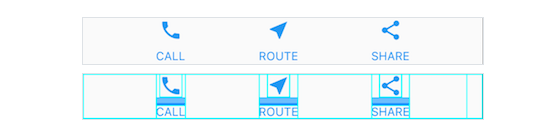
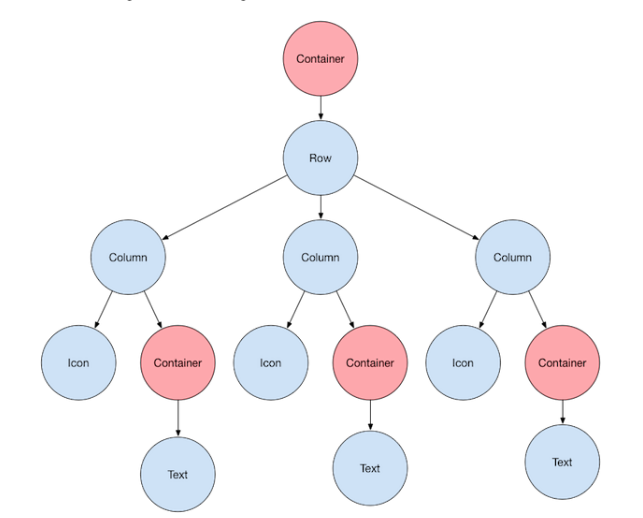

# flutter-intro

## What is Widget?
- Widgets are classes used to build UIs.
- Widgets are used for both layout and UI elements.
- Compose simple widgets to build complex widgets.

## Example

### Basic Widgets
#### Container
- A widget class that allows you to customize its child widget.
- For example, when you want to add padding, margins, borders, or background color, to name some of its capabilities.
- In this case, each `Text` widget is placed in a Container to add margins.

## Lay out a widget
